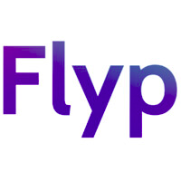

# flyp-automation

<div id="top"></div>
<!--
*** Thanks for checking out my web automation projecy.
*** that would make this better, please fork the repo and create a pull request
*** Thanks again! Now we can create something AMAZING together! :D
-->


<!-- PROJECT LOGO -->
<br />
<div align="center">
  <a href="https://github.com/othneildrew/Best-README-Template">
    
  </a>

  <h3 align="center">Flyp-automation project</h3>

  <p align="center">
    An awesome README file to jumpstart your projects!
  </p>
</div>


<!-- ABOUT THE PROJECT -->
## About The Project

We built this project to understand more about scrapping and web automation.


### Built With

This section should list any major frameworks/libraries used to bootstrap your project. Leave any add-ons/plugins for the acknowledgements section. Here are a few examples.

* [React.js](https://reactjs.org/)
* [Node.js](https://nodejs.org/)
* [Bootstrap](https://getbootstrap.com)

<p align="right">(<a href="#top">back to top</a>)</p>


<!-- GETTING STARTED -->
## Getting Started


### Prerequisites

This is an example of how to list things you need to use the software and how to install them.
* npm
  ```sh
  npm install
  ```

### Installation

This is how you can install and set up flyp-automation.

1. Read the Readme file at [https://github.com/MohamedEllouze/flyp-automation](https://github.com/MohamedEllouze/flyp-automation)

3. Clone the repo
   ```sh
   git clone https://github.com/MohamedEllouze/flyp-automation.git
   ```
3. Install NPM packages
   ```sh
   npm install
   ```
4.  Enter your API in `config.js`
   ```js
   const API_KEY = 'ENTER YOUR API';
   ```
5. Run the project with :
    ```sh
   npm start
   ```

<p align="right">(<a href="#top">back to top</a>)</p>


<!-- USAGE EXAMPLES -->
## Usage

HOME PAGE :

Fill the form then click the Button "SignUp"


Enter the profile link the click on the button "Get info"

<p align="right">(<a href="#top">back to top</a>)</p>


